# IBCt:I Believe Contract
##### EOS기반 dAPP
##### TestNet

>개인 프라이빗넷
>Azrue VM :표준 D2 v3(2개 vcpu, 8GB 메모리)
EOSIO v1.6.0
##### 소개
Reactjs, Eosjs, Scatter를 이용한 웹앱

##### Smart Contract
[GitHub - uminick/contractmngm](https://github.com/uminick/contractmngm)

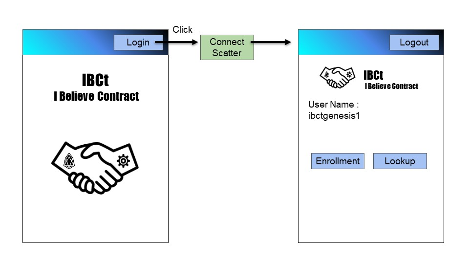
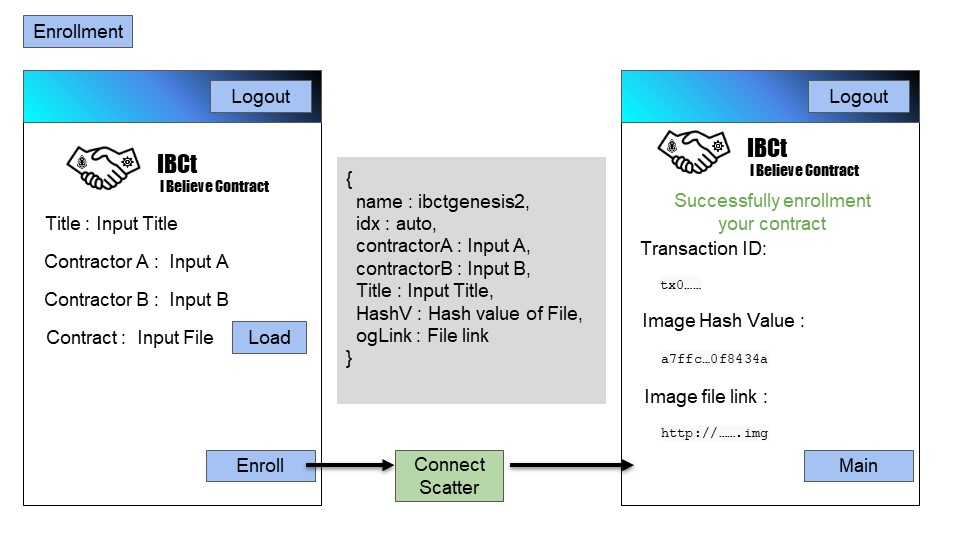
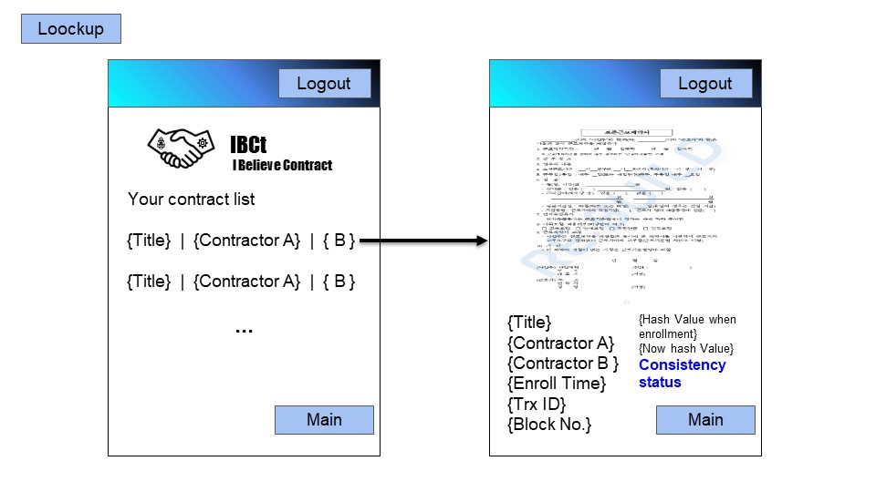
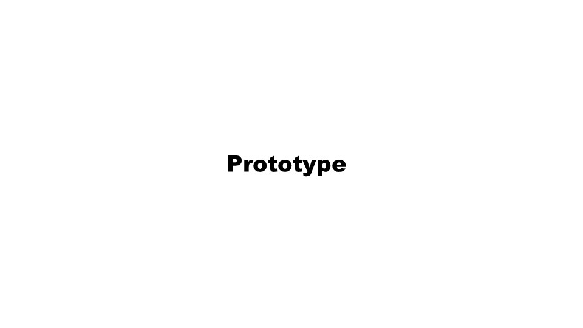
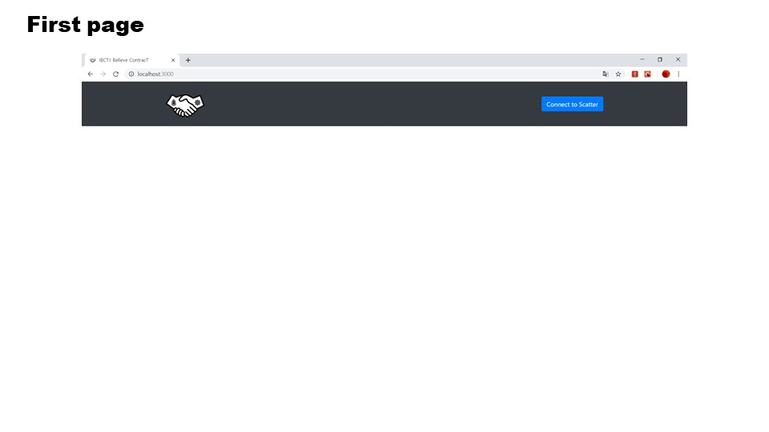
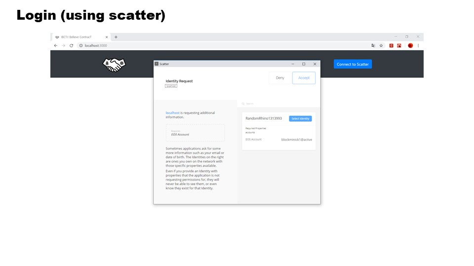
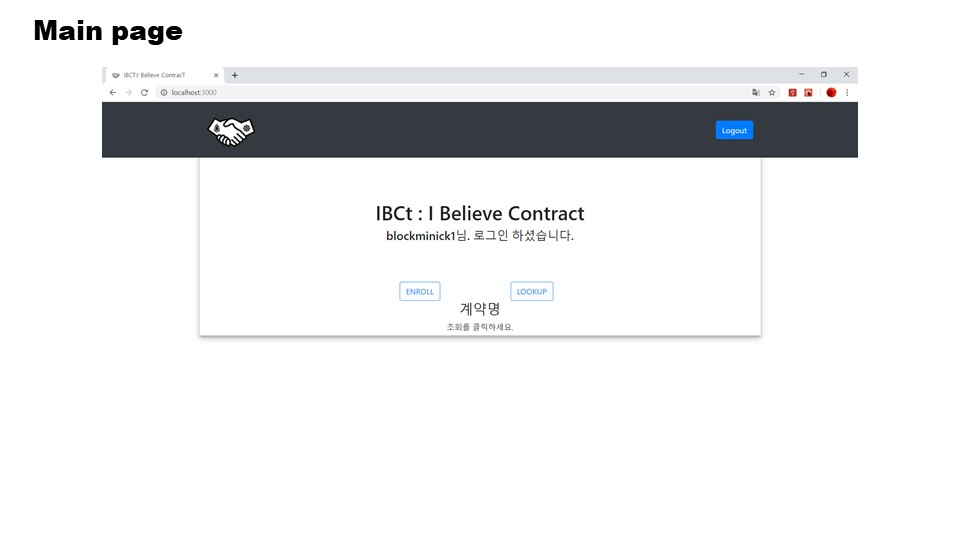
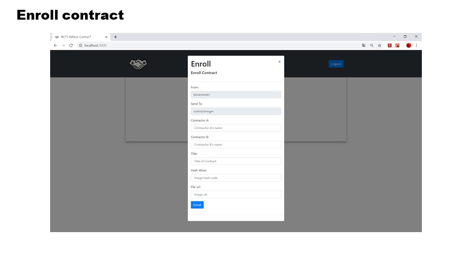
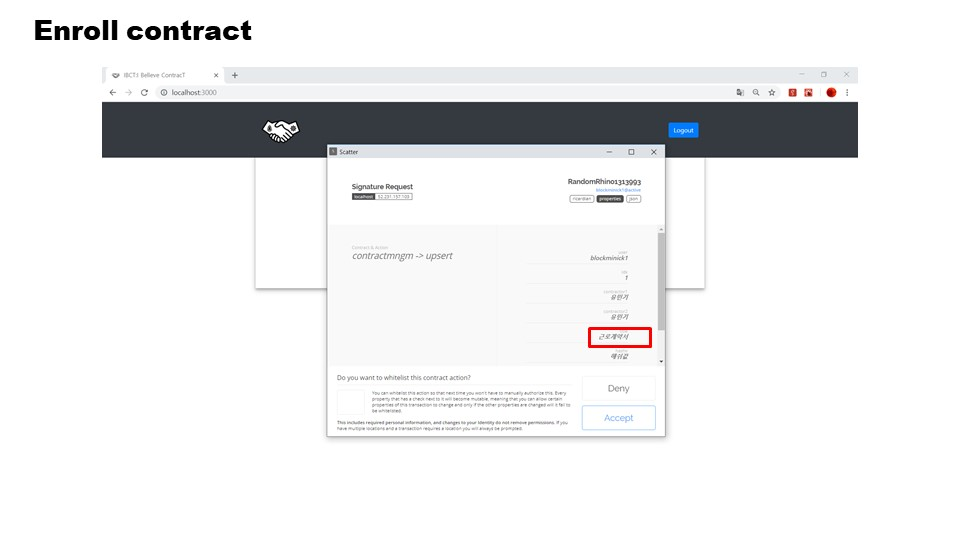

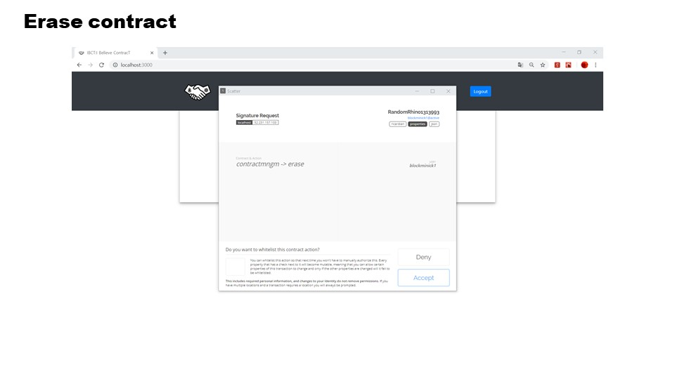
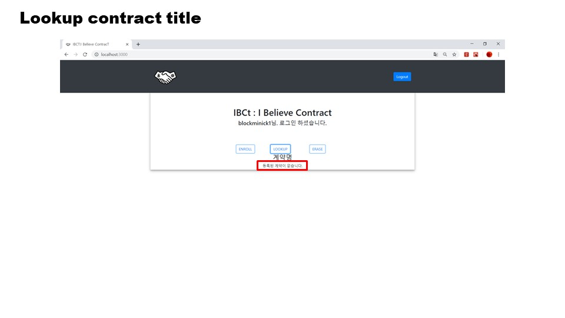
